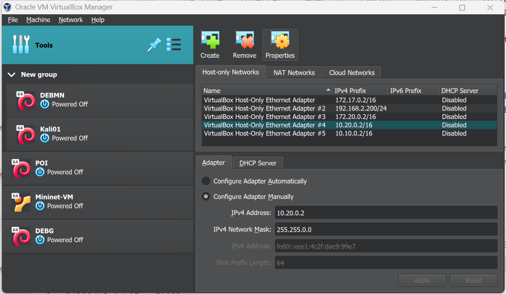
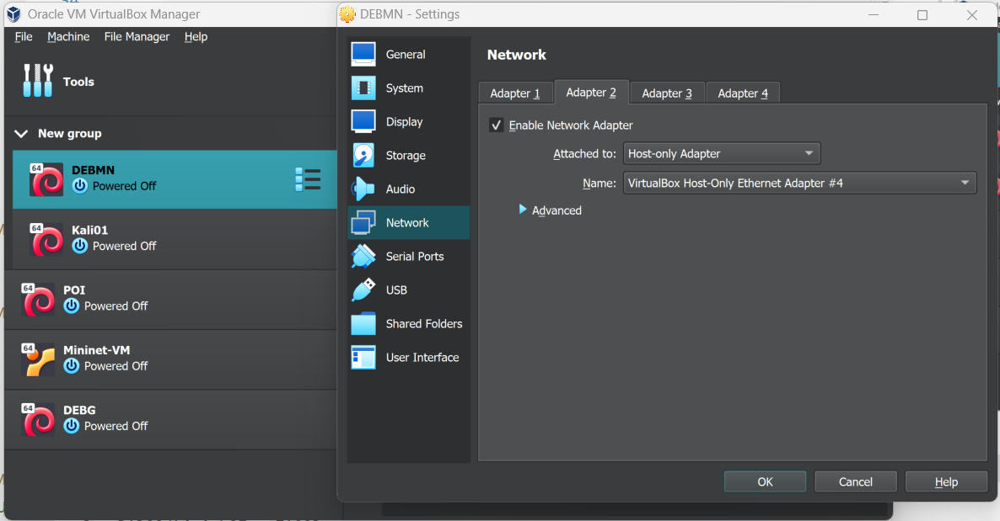

# cocoon_pv0102
PV plant PV 1x2

    netsh interface ipv4 set address name="Ethernet 6" static 192.168.3.8 255.255.255.0 192.168.3.1

## COLinker installation

    git clone https://github.com/jmmauricio/colinker.git
    cd colinker
    sudo pip3 install -e  . --break-system-packages

## Clone example PV 1x2 repo

    git clone https://github.com/jmmauricio/cocoon_pv0102.git

## Local-Local mode

### Build emulator
    cd cocoon_pv0102
    cd ./emec_emu/pv_1_2_bess/
    python pv_mn_bess_builder.py 

### Run emulator
    cd cocoon_pv0102
    cd ./emec_emu/pv_1_2_bess/
    python emulator.py -cfg_dev ../../local_local/config_devices_local_local.json -cfg_ctrl ../../config_controller.json

### Run devices (auto)
    cd cocoon_pv0102
    python ./local_local/run_devices_local_local.py

### Run PPC
    cd cocoon_pv0102
    python ./local_local/run_devices_local_local.py

### Run devices (individually)
    cd cocoon_pv0102
    python run_device.py POI    dmlm -cfg_dev ./local_local/config_devices_local_local.json -cfg_ctrl config_controller.json
    python run_device.py LV0101 dmlm -cfg_dev ./local_local/config_devices_local_local.json -cfg_ctrl config_controller.json
    python run_device.py LV0102 dmlm -cfg_dev ./local_local/config_devices_local_local.json -cfg_ctrl config_controller.json

Some tests can be done using `./local_local/test_local_local.py` module. 

## MININET-Local mode

### Build emulator
    cd cocoon_pv0102
    cd ./emec_emu/pv_1_2_bess/
    python pv_mn_bess_builder.py 

### Run emulator
    cd cocoon_pv0102
    cd ./emec_emu/pv_1_2_bess
    python emulator.py -cfg_dev ../../mininet_local/config_devices_mininet_local.json -cfg_ctrl ../../config_controller.json

### VirtualBox VM

At least 3 network adapters:

- NAT for internet conection (not used in the emulation)
- Host Only to connect the mininet network to the e-emulator running at the host
- Bridge to connect to a physical adapter and access to the mininet network (virtual actual side), that can be used to a man in the middle atack or by the CPN.

### Install colinker in Linux VM (DEBMN)
    cd cocoon_pv0102
    git clone https://github.com/jmmauricio/colinker.git
    cd colinker
    sudo pip3 install -e  . --break-system-packages

### Clone PV0102 example
    git clone https://github.com/jmmauricio/cocoon_pv0102.git

### Run MININET example
    cd cocoon_pv0102
    sudo python3 ./com_emu/pv_1_2_mn.py

### Run devices (auto) 
Open new terminal and run devices.
Each device linker is attached to the respective host:
    cd cocoon_pv0102
    sudo python3 run_devices_mininet_local.py 
    
Some tests can be found at folder `mininet_local`:
- `test_eemu_reach.py` to test the E-Emulator can be reached
- `test_poi_eemu.py` to test the E-Emulator can be reached from mininet 
- `test_ppc_pvs.py` to test PPC works and can control PVs 

### Run PPC 

    PPC python3 /home/cocoon/shared/cocoon/coppc/src/coppc/coppc.py

### Simulate an attack from host

### Run devices (nanually)
Open new terminal and run:

    POI python3 run_device.py 'POI' dmlm -cfg_dev config_devices_mininet_local.json -cfg_ctrl config_controller.json
    python run_device.py 'LV0101' dmlm -cfg_dev config_devices_mininet_local.json -cfg_ctrl config_controller.json
    python run_device.py 'LV0102' dmlm -cfg_dev config_devices_mininet_local.json -cfg_ctrl config_controller.json

## MININET-LAN mode

### Build emulator
    cd cocoon_pv0102
    cd ./emec_emu/pv_1_2_bess/
    python pv_mn_bess_builder.py 

### Run emulator 
    cd 
    python ./emec_emu/pv_1_2_bess/emulator.py -cfg_dev config_devices_mininet_lan.json -cfg_ctrl config_controller.json

### Run router
    python run_linker12.py -cfg_dev config_devices_mininet_lan_msi.json -cfg_ctrl config_controller.json

### Build mininet network in the Virtual Machine
    cd cocoon_pv0102
    sudo python3 ./com_emu/pv_1_2_mn.py

### Run device linkers 

Each linker is attached to the respective host:

    sudo python3 run_devices.py -cfg_dev config_devices_mininet_lan_msi.json -cfg_ctrl config_controller.json

### Test with PPC
    PPC python3 test_mininet_local.py
